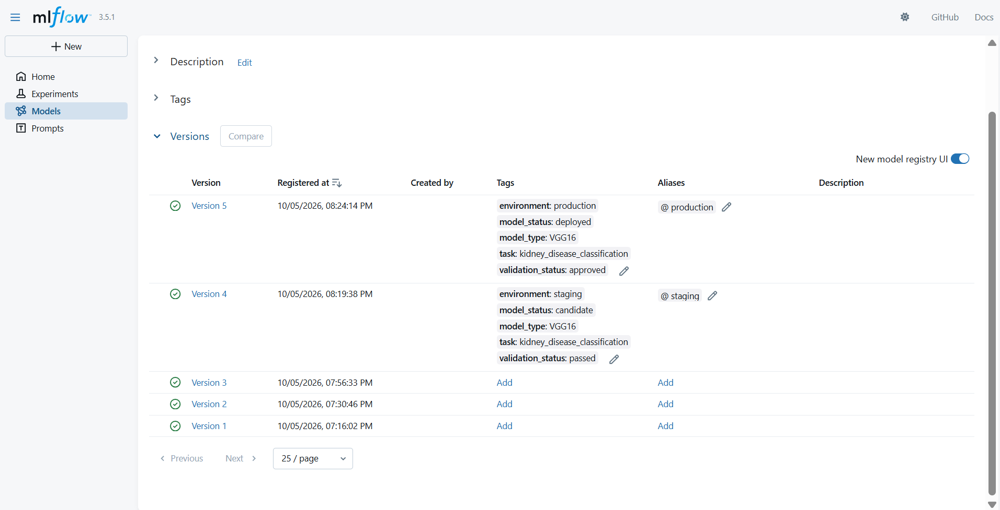

# kidney-Disease-Classification-MLflow-DV

clone the repository
```
git clone https://github.com/ethyne2666/kidney-Disease-Classification-MLflow-DVC.git
```

create virtual environment
```
py -3.8 -m venv kidney
```

*activate it*
```
.\kidney\Scripts\Activate.ps1 
```

install all the dependencies
```
pip install -r requirements.txt 
```


## Workflows

1. Update config.yaml
2. Update secrets.yaml [Optional]
3. Update params.yaml
4. Update the entity
5. Update the configuration manager in src config folder
6. Update the components
7. Update the pipeline
8. Update the main.py
9. Update the dvc.yaml
10. app.py

01_setup_data_ingestion files


the code that we have wrote in the note books we need to write in the python files this is known as *modular coding*


# MLflow

cmd
mlflow ui
#### dagshub


MLFLOW_TRACKING_URI=https://dagshub.com/charankumar2666/kidney-Disease-Classification-MLflow-DVC.mlflow <br>
MLFLOW_TRACKING_USERNAME=charankumar2666<br>
MLFLOW_TRACKING_PASSWORD=<br>
python script.py<br>


*Run this to export as env variables*:
```

$env MLFLOW_TRACKING_URI=https://dagshub.com/charankumar2666/kidney-Disease-Classification-MLflow-DVC.mlflow

$env MLFLOW_TRACKING_USERNAME=charankumar2666

$env MLFLOW_TRACKING_PASSWORD=

```



### DVC -  Data Version Control

*to track the stages's of the pipeline*
1. dvc init<br>
2. dvc repro<br>
3. dvc dag<br>


